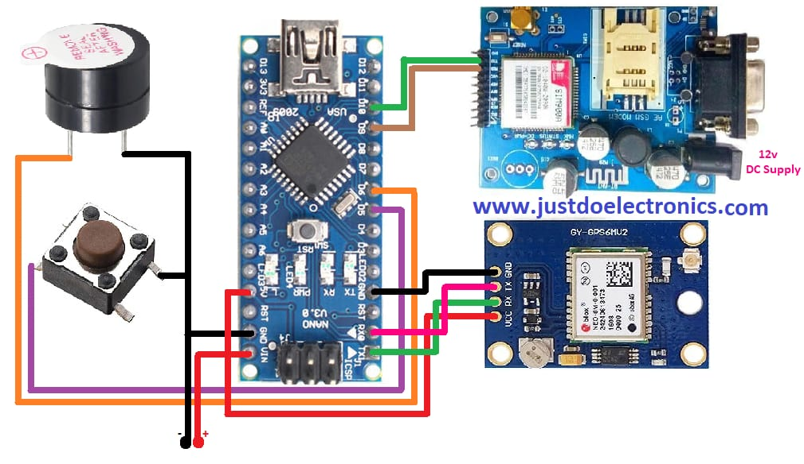

# Hardware-based-Safety-Device-
Designed and developed a compact, wearable safety device for women featuring an SOS button to trigger emergency alerts. Integrated real-time GPS tracking and GSM communication to instantly notify emergency contacts with the user’s live location.
This project combines embedded systems and IoT to provide a reliable and discreet emergency alert system for women. With a portable design that can be integrated into keychains or pendants, the device ensures immediate response during distress without needing a smartphone.

---

## Hardware Components

| Component            | Description                           |
|----------------------|---------------------------------------|
| Microcontroller       | Arduino Uno / Nano                   |
| GPS Module            | Neo-6M for live location tracking     |
| GSM Module            | SIM800L for sending SMS alerts        |
| Push Button           | Acts as the SOS trigger               |
| Power Supply          | Rechargeable battery (3.7V Li-ion)    |
| Supporting Components | Resistors, capacitors, wiring, etc.  |

---

## 🔌 Circuit Connections

---

## 💬 How It Works

1. User presses the SOS button.
2. The microcontroller reads GPS coordinates from the GPS module.
3. The GSM module sends an SMS with the location to emergency contacts.
4. The alert includes a clickable Google Maps link for real-time tracking.

Example SMS:

